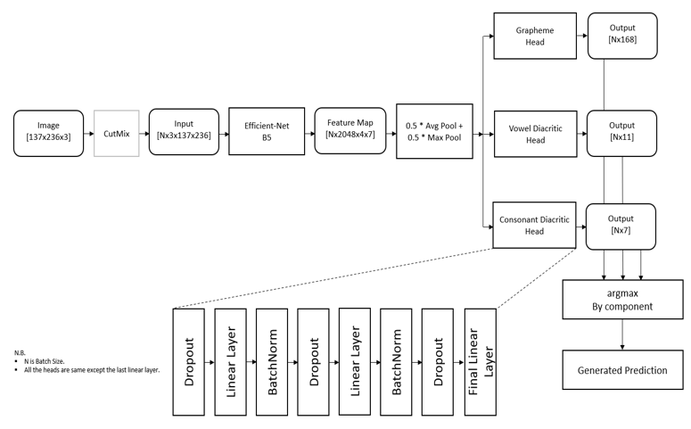

# Kaggle-Bengali.AI-Handwritten-Grapheme-Classification 167th Place Solution
In this [competition](https://www.kaggle.com/c/bengaliai-cv19), the task is to separately classify three constituent elements: grapheme root, vowel diacritics, and consonant diacritics from the image of a handwritten Bengali grapheme. I have been nominated for the highest performing student team from Bangladesh for this competition. A discussion thread based on my solution is also available in the [kaggle discussion forum](https://www.kaggle.com/c/bengaliai-cv19/discussion/144549).

## Dependencies
pytorch == 1.4.0  
cudatoolkit == 10.1  
[efficientnet](https://github.com/lukemelas/EfficientNet-PyTorch)  
numpy == 1.18.1  
pandas == 1.0.3  
scikit-learn == 0.22.1  
apex == 0.1  
tqdm == 4.44.1  

## Dataset
All the directories should be created manually before running the codes as mentioned in Directory_structure.txt file. All the folders should have both read and write access. After creating the directories with suitable permissions, competition data(only the train parquet files) must be placed in the '/data/' directory  
•	Image Size: 137x236 ( No preprocessing )

## Augmentation
•	CutMix

## Model
•	EfficientNet-B5 with three heads

## Training:
•	5 fold Configuration  
•	Data split on the basis of grapheme root labels  
•	Loss: Cross Entropy Loss  
•	Optimizer: Over9000  
•	Scheduler: Reduce On Plateau  
•	Gradient Accumulation  
•	Batch Size 100  
•	Initial Learning Rate 0.03  

## Inference:
•	Best Average recall checkpoints were used  
•	Simple Average of the outputs from 5 folds  
•	Inference kernel: https://www.kaggle.com/mohammadzunaed/efficientnet-b5-inference-kernel-pytorch?scriptVersionId=32245517  

## Things that did not work for me:
•	Preprocessing  
•	GridMask, Cutout, AugMix  
•	Label Smoothing Criterions  
•	Single head instead of three heads  
•	Activation functions and Convolutional layers in the heads  
